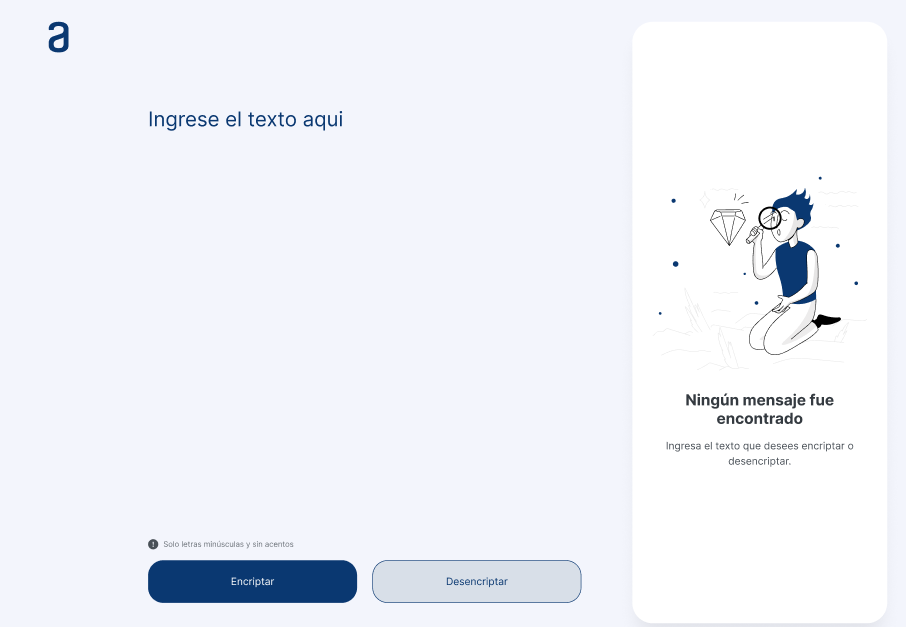

El proyecto de este repositorio es un encriptador de texto, el cual sigue las siguientes llaves de encriptación usadas las siguientes:
- La letra "e" es convertida para "enter"
- La letra "i" es convertida para "imes"
- La letra "a" es convertida para "ai"
- La letra "o" es convertida para "ober"
- La letra "u" es convertida para "ufat"

Este encriptador es el desafío del curso "Prácticando lógica de programación: Challenge Encriptador de texto" de Alura.
Se decidió seguir el diseño sugerido en el curso (imagen a continuación)

